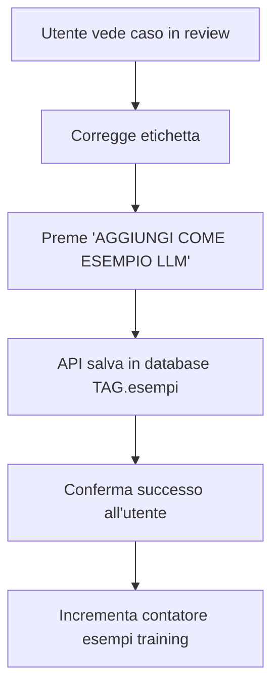
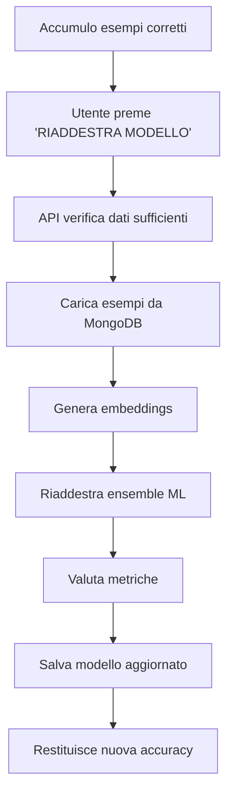

# API Documentation - Esempi LLM e Riaddestramento

**Autore:** Valerio Bignardi  
**Data:** 2025-09-07  
**Versione:** 1.0  

## Panoramica

Questa documentazione descrive le nuove API aggiunte al sistema di classificazione per gestire:
1. **Salvataggio di casi di review come esempi LLM** per migliorare le prestazioni future
2. **Riaddestramento manuale del modello ML** utilizzando i dati corretti dalla review umana
3. **Monitoraggio dello stato del training** per ogni tenant

## Endpoint Disponibili

### 1. Aggiungi Caso come Esempio LLM

**Endpoint:** `POST /api/examples/add-review-case`

**Scopo:** Salva una conversazione corretta dall'umano come esempio di training per migliorare le prestazioni LLM future.

**Request Body:**
```json
{
  "session_id": "session_001",
  "conversation_text": "Ciao, ho bisogno di prenotare una visita cardiologica urgente",
  "etichetta_corretta": "PRENOTAZIONE_VISITA",
  "categoria": "CARDIOLOGIA",
  "tenant_id": 1,
  "note_utente": "L'utente aveva fretta e voleva una visita urgente, per questo è prenotazione e non semplice informazione"
}
```

**Campi Obbligatori:**
- `session_id`: ID univoco della sessione
- `conversation_text`: Testo completo della conversazione
- `etichetta_corretta`: Etichetta corretta assegnata dall'umano
- `tenant_id`: ID del tenant

**Campi Opzionali:**
- `categoria`: Categoria per raggruppamento (default: stesso valore di etichetta_corretta)
- `note_utente`: Note scritte dall'utente per spiegare la decisione di classificazione

**Response Success (200):**
```json
{
  "success": true,
  "esempio_id": 123,
  "message": "Esempio LLM creato con successo: ID 123",
  "details": {
    "esempio_name": "review_caso_session_001_20250107_103000",
    "categoria": "CARDIOLOGIA",
    "engine": "LLM",
    "esempio_type": "CONVERSATION",
    "processing_time": 0.45,
    "tenant_id": 1,
    "tenant_name": "Humanitas"
  }
}
```

**Response Error (400/404/500):**
```json
{
  "success": false,
  "esempio_id": null,
  "message": "Descrizione dell'errore",
  "details": {
    "validation_error": true
  }
}
```

### 2. Riaddestramento Manuale Modello

**Endpoint:** `POST /api/training/manual-retrain`

**Scopo:** Riaddestra il modello ML utilizzando tutti i dati corretti dalla review umana per migliorare l'accuracy.

**Request Body:**
```json
{
  "tenant_id": 1,
  "force": false
}
```

**Campi Obbligatori:**
- `tenant_id`: ID del tenant

**Campi Opzionali:**
- `force`: Se true, ignora controlli di sicurezza (default: false)

**Response Success (200):**
```json
{
  "success": true,
  "accuracy": 0.867,
  "message": "Riaddestramento completato - Accuracy: 0.867",
  "training_stats": {
    "accuracy": 0.867,
    "training_samples": 150,
    "unique_classes": 8,
    "processing_time": 12.34,
    "model_saved": "models/retrained_humanitas_20250107_103000",
    "force_mode": false,
    "bertopic_augmented": true,
    "precision": 0.85,
    "recall": 0.89,
    "f1_score": 0.87
  }
}
```

**Response Error (400/404/500):**
```json
{
  "success": false,
  "accuracy": 0.0,
  "message": "Descrizione dell'errore",
  "training_stats": {
    "data_found": 3,
    "minimum_required": 5,
    "insufficient_data": true
  }
}
```

### 3. Status Training

**Endpoint:** `GET /api/training/status/<tenant_id>`

**Scopo:** Recupera informazioni sullo stato attuale del modello e del training per un tenant specifico.

**Parametri URL:**
- `tenant_id`: ID del tenant (integer)

**Response Success (200):**
```json
{
  "tenant_id": 1,
  "tenant_name": "Humanitas",
  "model_loaded": true,
  "last_training": "2025-01-07T10:30:00.000Z",
  "training_samples": 150,
  "accuracy": 0.85,
  "pending_reviews": 5
}
```

**Response Error (404/500):**
```json
{
  "error": "Tenant con ID 1 non trovato",
  "details": {
    "exception": "Dettagli dell'errore"
  }
}
```

## Esempi di Utilizzo

### JavaScript/React con Axios

```javascript
import axios from 'axios';

const API_BASE = 'http://localhost:5001/api';

// 1. Aggiungere esempio LLM
const addLLMExample = async (sessionData) => {
  try {
    const response = await axios.post(`${API_BASE}/examples/add-review-case`, {
      session_id: sessionData.sessionId,
      conversation_text: sessionData.text,
      etichetta_corretta: sessionData.correctLabel,
      categoria: sessionData.category,
      tenant_id: 1
    });
    
    console.log('Esempio aggiunto:', response.data.esempio_id);
    return response.data;
    
  } catch (error) {
    console.error('Errore:', error.response?.data?.message);
    throw error;
  }
};

// 2. Riaddestramento modello
const retrainModel = async (tenantId, force = false) => {
  try {
    const response = await axios.post(`${API_BASE}/training/manual-retrain`, {
      tenant_id: tenantId,
      force: force
    });
    
    console.log('Accuracy:', (response.data.accuracy * 100).toFixed(1) + '%');
    return response.data;
    
  } catch (error) {
    console.error('Errore riaddestramento:', error.response?.data?.message);
    throw error;
  }
};

// 3. Status training
const getTrainingStatus = async (tenantId) => {
  try {
    const response = await axios.get(`${API_BASE}/training/status/${tenantId}`);
    return response.data;
    
  } catch (error) {
    console.error('Errore status:', error.response?.data?.message);
    throw error;
  }
};
```

### Python con requests

```python
import requests
import json

API_BASE = 'http://localhost:5001/api'

# 1. Aggiungere esempio LLM
def add_llm_example(session_id, conversation_text, correct_label, tenant_id, category=None, user_notes=None):
    data = {
        'session_id': session_id,
        'conversation_text': conversation_text,
        'etichetta_corretta': correct_label,
        'categoria': category,
        'note_utente': user_notes,
        'tenant_id': tenant_id
    }
    
    response = requests.post(f'{API_BASE}/examples/add-review-case', json=data)
    
    if response.status_code == 200:
        result = response.json()
        print(f"✅ Esempio creato: ID {result['esempio_id']}")
        return result
    else:
        error = response.json()
        print(f"❌ Errore: {error['message']}")
        raise Exception(error['message'])

# 2. Riaddestramento modello
def retrain_model(tenant_id, force=False):
    data = {
        'tenant_id': tenant_id,
        'force': force
    }
    
    response = requests.post(f'{API_BASE}/training/manual-retrain', json=data)
    
    if response.status_code == 200:
        result = response.json()
        accuracy = result['accuracy'] * 100
        print(f"✅ Riaddestramento completato - Accuracy: {accuracy:.1f}%")
        return result
    else:
        error = response.json()
        print(f"❌ Errore riaddestramento: {error['message']}")
        raise Exception(error['message'])

# 3. Status training
def get_training_status(tenant_id):
    response = requests.get(f'{API_BASE}/training/status/{tenant_id}')
    
    if response.status_code == 200:
        return response.json()
    else:
        error = response.json()
        print(f"❌ Errore status: {error['error']}")
        raise Exception(error['error'])

# Esempio di utilizzo
if __name__ == "__main__":
    tenant_id = 1
    
    # Aggiungi esempio
    add_llm_example(
        session_id="test_001",
        conversation_text="Vorrei prenotare una visita",
        correct_label="PRENOTAZIONE_VISITA",
        tenant_id=tenant_id,
        category="GENERALE",
        user_notes="Richiesta diretta di prenotazione, non informazioni generali"
    )
    
    # Controlla status
    status = get_training_status(tenant_id)
    print(f"Training samples: {status['training_samples']}")
    
    # Riaddestra se necessario
    if status['training_samples'] >= 5:
        retrain_model(tenant_id)
```

### cURL

```bash
# 1. Aggiungere esempio LLM
curl -X POST http://localhost:5001/api/examples/add-review-case \
  -H "Content-Type: application/json" \
  -d '{
    "session_id": "test_001",
    "conversation_text": "Vorrei prenotare una visita cardiologica",
    "etichetta_corretta": "PRENOTAZIONE_VISITA",
    "categoria": "CARDIOLOGIA",
    "note_utente": "Richiesta esplicita di prenotazione con specializzazione specifica",
    "tenant_id": 1
  }'

# 2. Riaddestramento modello
curl -X POST http://localhost:5001/api/training/manual-retrain \
  -H "Content-Type: application/json" \
  -d '{
    "tenant_id": 1,
    "force": false
  }'

# 3. Status training
curl -X GET http://localhost:5001/api/training/status/1
```

## Flusso di Lavoro Consigliato

### 1. Workflow Review → Esempio LLM



### 2. Workflow Riaddestramento



## Considerazioni Tecniche

### Performance
- **Aggiunta esempi:** ~0.5s per caso (inserimento database)
- **Riaddestramento:** ~10-30s a seconda del numero di esempi (5-500)
- **Status check:** ~0.1s (query leggera)

### Limiti
- **Riaddestramento:** Richiede minimo 5 esempi corretti
- **Rate limiting:** Non implementato (da aggiungere in produzione)
- **Timeout:** 30s per riaddestramento (configurabile)

### Sicurezza
- **Validazione:** Tutti i campi obbligatori sono validati
- **Tenant isolation:** Ogni operazione è isolata per tenant
- **Error handling:** Gestione completa degli errori con messaggi dettagliati

### Database Impact
- **Esempi LLM:** Inserimento in `TAG.esempi` con metadati completi
- **Training data:** Lettura da MongoDB per esempi review
- **Modelli:** Salvataggio automatico in `models/` directory

## Monitoraggio e Debug

### Log Files
- **Server API:** `server.log` con timestamp e dettagli operazioni
- **Pipeline:** Logging dettagliato delle operazioni ML
- **Database:** Log delle query e performance

### Metriche Chiave
- **Esempi LLM:** Numero totale per tenant
- **Accuracy trend:** Evoluzione accuracy nel tempo
- **Training frequency:** Frequenza riaddestramento per tenant
- **Error rate:** Tasso di errori per endpoint

## Troubleshooting

### Errori Comuni

**"Parametri mancanti"**
- Verificare che tutti i campi obbligatori siano presenti nel JSON

**"Tenant non trovato"**
- Verificare che il `tenant_id` esista nel database

**"Dati insufficienti per training"**
- Servono almeno 5 esempi corretti dalla review umana

**"Errore nella creazione dell'esempio"**
- Verificare connessione database MySQL
- Controllare che la tabella `TAG.esempi` esista

**"Training ML fallito"**
- Verificare che gli embeddings siano generati correttamente
- Controllare che ci siano esempi con etichette diverse

### Comandi Debug

```bash
# Controlla status server
curl http://localhost:5001/health

# Verifica tenant disponibili  
curl http://localhost:5001/api/tenants

# Test connessione database
python -c "from Utils.prompt_manager import PromptManager; pm = PromptManager(); print('Database OK')"

# Verifica esempi nel database
mysql -u root -p TAG -e "SELECT COUNT(*) as esempi_count FROM esempi WHERE tenant_id = 1;"
```

---

Per ulteriori informazioni o supporto, contattare il team di sviluppo.
