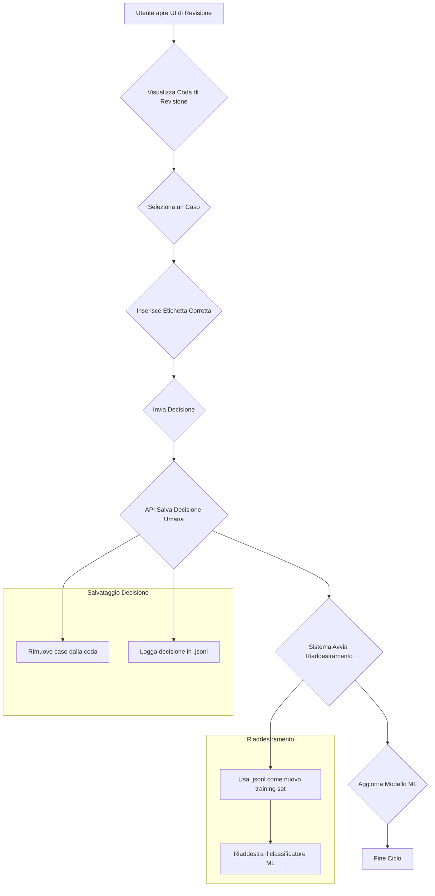

# Logica di Funzionamento: Classificazione e Training Supervisionato

Questo documento descrive in dettaglio la logica architetturale e i flussi operativi del sistema di classificazione, con un focus specifico sull'interazione tra la classificazione automatica e il training supervisionato dall'uomo.

## 1. Architettura e Componenti Chiave

Il sistema è composto da moduli specializzati che collaborano per orchestrare un ciclo di classificazione, revisione e miglioramento continuo.

| Componente                                | File                                                 | Responsabilità Principale                                                                                             |
| ----------------------------------------- | ---------------------------------------------------- | --------------------------------------------------------------------------------------------------------------------- |
| **API Server**                            | `server.py`                                          | Espone gli endpoint REST per avviare la classificazione, gestire la revisione umana e monitorare lo stato del sistema. |
| **End-to-End Pipeline**                   | `Pipeline/end_to_end_pipeline.py`                    | Orchestra il flusso completo di classificazione: estrazione dati, clustering, training e salvataggio.                 |
| **Quality Gate Engine**                   | `QualityGate/quality_gate_engine.py`                 | Nucleo del training supervisionato. Identifica i casi incerti, gestisce la coda di revisione e il riaddestramento. |
| **Advanced Ensemble Classifier**          | `Classification/advanced_ensemble_classifier.py`     | Esegue le previsioni combinando un modello ML (es. RandomForest) e un LLM (es. Mistral) con pesi adattivi.         |
| **Intelligent Intent Clusterer**          | `Clustering/intelligent_intent_clusterer.py`         | Raggruppa le conversazioni in cluster semantici utilizzando l'LLM per suggerire etichette iniziali.                |
| **Human Review UI**                       | `human-review-ui/`                                   | Interfaccia grafica (React) che permette all'utente di visualizzare, correggere e approvare le classificazioni.       |
| **Database Connector**                    | `TagDatabase/tag_database_connector.py`              | Gestisce la persistenza dei dati (classificazioni, decisioni umane) su un database MySQL.                             |
| **Semantic Memory Manager**               | `SemanticMemory/semantic_memory_manager.py`          | Gestisce una memoria semantica per rilevare la "novità" di una conversazione rispetto a quelle già viste.           |

---

## 2. Flusso 1: Classificazione Completa

Questo flusso viene attivato, ad esempio, tramite l'endpoint `POST /classify/all/<client_name>`. Il suo scopo è processare un grande volume di conversazioni (nuove o tutte) e generare classificazioni automatiche.

**Diagramma di Flusso:**
```mermaid
graph TD
    A[Avvio Classificazione Completa] --> B{Estrai Sessioni dal DB};
    B --> C{Clustering Intelligente};
    C --> D{Addestra/Aggiorna Modello ML};
    D --> E{Classifica Sessioni con Ensemble (LLM+ML)};
    E --> F{Salva Classificazioni nel DB};
    F --> G[Fine];

    subgraph "Clustering Intelligente"
        C1[Genera Embeddings]
        C2[LLM suggerisce etichette]
        C3[HDBSCAN raggruppa per similarità]
    end
    B --> C1 --> C2 --> C3

    subgraph "Classificazione Ensemble"
        E1[Ottieni previsione LLM]
        E2[Ottieni previsione ML]
        E3[Combina con pesi adattivi]
    end
    E --> E1 --> E3
    E --> E2 --> E3
```

**Passaggi Dettagliati:**

1.  **Estrazione Dati**:
    *   Il `SessionAggregator` legge le conversazioni grezze dal database del cliente (es. `humanitas`).
    *   Le conversazioni vengono aggregate in sessioni uniche, scartando quelle irrilevanti (es. con un solo messaggio).

2.  **Clustering Intelligente (`IntelligentIntentClusterer`)**:
    *   **Embedding**: Tutte le conversazioni vengono trasformate in vettori numerici (embeddings) tramite il modello `LaBSE`.
    *   **Suggerimento Etichette (LLM)**: L'LLM (Mistral) analizza un campione di conversazioni per ogni potenziale cluster e suggerisce un'etichetta semantica (es. `prenotazione_esami`).
    *   **Clustering (HDBSCAN)**: L'algoritmo HDBSCAN raggruppa gli embeddings simili in cluster. Le etichette suggerite dall'LLM vengono associate a questi cluster. Le conversazioni che non rientrano in nessun gruppo vengono marcate come "outlier".

3.  **Addestramento del Classificatore (`AdvancedEnsembleClassifier`)**:
    *   I risultati del clustering (conversazioni + etichette) vengono usati come dati di addestramento per il modello di Machine Learning (un `VotingClassifier` che combina RandomForest, SVM, etc.).
    *   Il modello ML impara a mappare gli embeddings delle conversazioni alle etichette corrette.
    *   Il modello addestrato viene salvato su disco per un uso futuro.

4.  **Classificazione e Salvataggio**:
    *   Ogni sessione viene classificata dall'`AdvancedEnsembleClassifier`.
    *   **Previsione LLM**: L'LLM analizza il testo e fornisce una previsione con un punteggio di confidenza.
    *   **Previsione ML**: Il modello ML addestrato analizza l'embedding e fornisce un vettore di probabilità per ogni etichetta.
    *   **Voto Ensemble**: Le due previsioni vengono combinate tramite una media pesata (es. 60% LLM, 40% ML). Il sistema può adattare questi pesi in base alla confidenza di ciascun modello.
    *   Il risultato finale (etichetta e confidenza) viene salvato nella tabella `session_classifications` del database.

---

## 3. Flusso 2: Training Supervisionato e Revisione Umana

Questo flusso, attivato dall'endpoint `POST /train/supervised/<client_name>` o da un pulsante nell'UI, non addestra direttamente il modello, ma **identifica e prepara i casi più meritevoli di revisione umana**.

**Diagramma di Flusso:**
```mermaid
graph TD
    A[Avvio Training Supervisionato] --> B{Analizza Classificazioni Salvate};
    B --> C{Identifica Casi da Rivedere};
    C --> D{Popola la Coda di Revisione};
    D --> E[UI Mostra i Casi all'Utente];

    subgraph "Criteri di Identificazione"
        C1[Bassa Confidenza]
        C2[Disaccordo (LLM vs ML)]
        C3[Novità (Conversazione nuova)]
    end
    C --> C1
    C --> C2
    C --> C3
```

**Passaggi Dettagliati:**

1.  **Analisi delle Classificazioni Esistenti**:
    *   Il `QualityGateEngine` legge le classificazioni salvate nel database.

2.  **Identificazione dei Casi da Rivedere**:
    *   Per ogni classificazione, il sistema valuta se merita una revisione umana basandosi su tre criteri principali:
        *   **Bassa Confidenza**: La confidenza finale dell'ensemble è inferiore a una soglia (es. < 0.7).
        *   **Disaccordo (Disagreement)**: L'etichetta predetta dall'LLM è diversa da quella predetta dal modello ML. Questo è un segnale forte di ambiguità.
        *   **Novità (Novelty)**: La conversazione è semanticamente molto diversa da quelle viste in passato. Questo viene calcolato dal `SemanticMemoryManager`, che confronta l'embedding della nuova conversazione con un archivio di embeddings noti.

3.  **Popolamento della Coda di Revisione**:
    *   Ogni caso identificato viene salvato come un `ReviewCase` in un database dedicato alla revisione (`human_review_humanitas.db`).
    *   Un `ReviewCase` contiene tutte le informazioni necessarie per la decisione: il testo della conversazione, le previsioni di LLM e ML, i punteggi di confidenza e il motivo della revisione.

---

## 4. Flusso 3: Interazione Umana e Riaddestramento

Questo è il cuore del ciclo di feedback, dove l'intelligenza umana corregge e valida il lavoro del sistema AI.

**Diagramma di Flusso:**


**Passaggi Dettagliati:**

1.  **Risoluzione del Caso (UI)**:
    *   L'utente, tramite l'interfaccia React, visualizza la lista dei casi in attesa di revisione.
    *   Seleziona un caso, legge la conversazione e le previsioni dei modelli.
    *   Inserisce l'etichetta che ritiene corretta e invia la sua decisione.

2.  **Salvataggio della Decisione Umana**:
    *   L'interfaccia invia la decisione all'endpoint API `POST /api/review/<client_name>/cases/<case_id>/resolve`.
    *   Il `QualityGateEngine` riceve la richiesta.
    *   **Rimuove il caso dalla coda di revisione attiva.**
    *   **Registra la decisione in un file di log immutabile** (es. `training_decisions_humanitas.jsonl`). Questo file diventa la "verità assoluta" (ground truth) fornita dall'uomo e verrà usato per il riaddestramento.

3.  **Riaddestramento del Modello**:
    *   Il riaddestramento può essere attivato manualmente (`POST /api/retrain/<client_name>`) o automaticamente dopo un certo numero di nuove decisioni umane (es. ogni 10).
    *   Il `QualityGateEngine` legge tutte le decisioni umane dal file `.jsonl`.
    *   Questi dati di alta qualità vengono usati per **riaddestrare da zero o aggiornare il modello di Machine Learning**.
    *   Il vecchio modello viene archiviato e sostituito da quello nuovo, più performante.

---

## 5. Come la Classificazione Umana Migliora il Sistema

L'interazione umana è fondamentale per chiudere il cerchio e creare un sistema che migliora nel tempo.

1.  **Correzione degli Errori del Modello ML**: Quando un utente corregge una previsione del modello ML, il riaddestramento insegna al modello a non ripetere lo stesso errore. La prossima volta che vedrà una conversazione simile, la sua previsione sarà più accurata.

2.  **Risoluzione delle Ambiguità (Disaccordo LLM vs ML)**: Le decisioni umane sui casi di disaccordo forniscono al modello ML esempi chiari su come classificare conversazioni ambigue, rendendolo più robusto.

3.  **Apprendimento di Nuovi Concetti (Novelty)**: Quando una conversazione "nuova" viene etichettata da un umano, il sistema impara un nuovo pattern. Questo è cruciale per adattarsi a nuovi tipi di richieste dei clienti senza intervento manuale di un data scientist.

4.  **Impatto sulla Classificazione Completa Futura**:
    *   Dopo il riaddestramento, il **modello ML aggiornato** viene utilizzato nel flusso di "Classificazione Completa".
    *   Questo significa che le nuove sessioni verranno classificate con maggiore accuratezza dal componente ML dell'ensemble.
    *   Di conseguenza, ci saranno **meno casi di bassa confidenza e meno disaccordi** con l'LLM, riducendo il carico di lavoro per la revisione umana e aumentando il grado di automazione del sistema.

In sintesi, il sistema è progettato come un **ciclo virtuoso**: la classificazione automatica produce casi interessanti per l'uomo, l'uomo fornisce conoscenza di alta qualità e questa conoscenza rende la classificazione automatica successiva più intelligente e affidabile.
