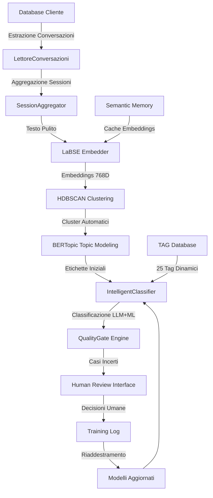
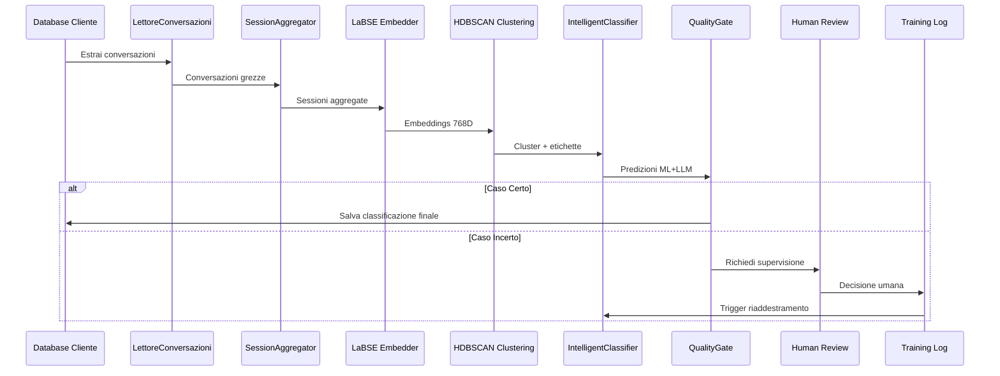
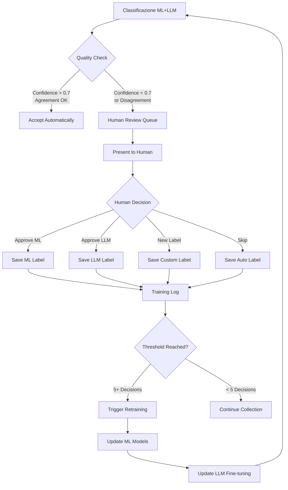
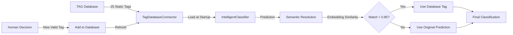

## Documentazione Completa del Sistema di Classificazione Supervisionata

Basandomi sull'analisi approfondita del codice, ti presento la documentazione completa del sistema di classificazione supervisionata con tutti i flussi di processo e diagrammi.

## 1. ARCHITETTURA GENERALE DEL SISTEMA

Il sistema implementa una pipeline di classificazione supervisionata end-to-end con i seguenti componenti principali:

### 1.1 Componenti Fondamentali
- **EndToEndPipeline**: Orchestratore principale del processo
- **LettoreConversazioni**: Estrazione dati da database clienti
- **LaBSEEmbedder**: Generazione embeddings semantici (768 dimensioni)
- **HDBSCANClusterer**: Clustering automatico per scoperta categorie
- **IntelligentClassifier**: Classificazione ibrida LLM+ML
- **QualityGateEngine**: Sistema di controllo qualità e supervisione umana
- **TagDatabaseConnector**: Gestione dinamica tag da database MySQL

### 1.2 Database e Storage
- **Database TAG (MySQL)**: 25 tag predefiniti in `tags` table (tag_name, tag_description)
- **Database Cliente**: Conversazioni storiche da processare
- **Semantic Memory**: Cache embeddings per performance
- **Training Logs**: Decisioni umane per riaddestramento

## 2. FLUSSO PRINCIPALE DI ELABORAZIONE



## 3. ESTRAZIONE E PREPROCESSING DELLE CONVERSAZIONI

### 3.1 Processo di Estrazione
```python
class LettoreConversazioni:
    """
    Estrae conversazioni dai database clienti e le prepara per l'analisi
    """
    
    def get_conversations_for_analysis(self, tenant_name: str) -> List[Dict]:
        """
        Scopo: Estrae tutte le conversazioni disponibili per il tenant specificato
        Input: tenant_name (nome del cliente)
        Output: Lista di conversazioni con metadati
        """
```

**Fonte Dati**: Database MySQL specifico per ogni cliente  
**Campi Estratti**: session_id, conversation_text, timestamp, metadata  
**Filtri**: Conversazioni degli ultimi 30 giorni (configurabile)

### 3.2 Aggregazione Sessioni
```python
class SessionAggregator:
    """
    Aggrega multiple interazioni in sessioni coerenti
    """
    
    def aggregate_sessions(self, conversations: List[Dict]) -> Dict[str, Dict]:
        """
        Scopo: Unisce conversazioni frammentate in sessioni complete
        Input: Lista conversazioni grezze
        Output: Dizionario sessioni aggregate con testo_completo
        """
```

**Logica di Aggregazione**:
- Raggruppa per session_id e timestamp
- Concatena messaggi multipli in testo_completo
- Calcola durata e numero interazioni
- Aggiunge metadati di qualità

## 4. GENERAZIONE EMBEDDINGS E CLUSTERING

### 4.1 Embeddings Semantici (LaBSE)
```python
class LaBSEEmbedder:
    """
    Genera embeddings semantici multilingue usando LaBSE
    """
    
    def generate_embeddings(self, texts: List[str]) -> np.ndarray:
        """
        Scopo: Converte testi in vettori semantici 768-dimensionali
        Input: Lista di testi delle conversazioni
        Output: Matrice embeddings normalizzati
        Ultimo aggiornamento: 2025-01-20
        """
```

**Caratteristiche**:
- Modello: sentence-transformers/LaBSE
- Dimensioni: 768 features per embedding
- Normalizzazione: L2 normalization per similarità coseno
- Cache: Semantic memory per evitare ricalcoli

### 4.2 Clustering HDBSCAN
```python
class HDBSCANClusterer:
    """
    Clustering delle sessioni usando HDBSCAN per scoperta automatica di categorie
    """
    
    def fit_predict(self, embeddings: np.ndarray) -> np.ndarray:
        """
        Scopo: Identifica cluster naturali nelle conversazioni
        Input: Matrice embeddings normalizzati
        Output: Array etichette cluster (-1 per outlier)
        Parametri: min_cluster_size=5, min_samples=3, metric=cosine
        """
```

**Algoritmo**:
- **HDBSCAN**: Density-based clustering gerarchico
- **Parametri**: min_cluster_size=5, min_samples=3
- **Metrica**: Cosine similarity su embeddings normalizzati
- **Output**: Cluster labels + probabilities + outlier scores

## 5. CLASSIFICAZIONE IBRIDA LLM+ML

### 5.1 Sistema di Tag Dinamici
```python
class TagDatabaseConnector:
    """
    Gestisce l'accesso dinamico ai tag dal database MySQL
    """
    
    def get_all_tags(self) -> List[Dict[str, str]]:
        """
        Scopo: Carica tutti i tag disponibili dal database TAG.tags
        Output: Lista con tag_name e tag_description per ogni categoria
        Connessione: MySQL database TAG, tabella tags
        """
```

**Database TAG Structure**:
- **Tabella**: TAG.tags
- **Campi**: tag_name (varchar), tag_description (text)
- **Contenuto**: 25 categorie predefinite caricate dinamicamente
- **Esempio**: 
  - tag_name: "prenotazione_visite"
  - tag_description: "Richieste di prenotazione visite mediche e esami"

### 5.2 Classificatore Intelligente
```python
class IntelligentClassifier:
    """
    Classificatore ibrido che combina ML ensemble e LLM per massima accuratezza
    """
    
    def _semantic_label_resolution(self, predicted_label: str) -> str:
        """
        Scopo: Risolve etichette usando similarità semantica con tag database
        Input: Etichetta predetta da algoritmi
        Output: Tag validato dal database o etichetta originale
        Soglia: 0.85 similarità coseno per match valido
        """
```

**Pipeline di Classificazione**:
1. **ML Ensemble**: Random Forest + SVM + XGBoost su features embeddings
2. **LLM Classification**: Mistral/OpenAI con prompt specifico per dominio medico
3. **Semantic Resolution**: Matching con tag database via similarità embeddings
4. **Confidence Scoring**: Combinazione pesata delle confidenze

### 5.3 Algoritmi di Generazione Tag

#### A) Topic Modeling con BERTopic
```python
class BERTopicFeatureProvider:
    """
    Fornisce feature di topic usando BERTopic per scoperta automatica temi
    """
    
    def fit(self, texts: List[str], embeddings: np.ndarray) -> "BERTopicFeatureProvider":
        """
        Scopo: Addestra BERTopic su corpus conversazioni
        Algoritmo: UMAP reduction + HDBSCAN clustering + c-TF-IDF
        Parametri: n_neighbors=15, min_cluster_size=5, calculate_probabilities=True
        """
```

**Processo BERTopic**:
- **UMAP**: Riduzione dimensionale embeddings (768→5D)
- **HDBSCAN**: Clustering in spazio ridotto
- **c-TF-IDF**: Estrazione keyword rappresentative per topic
- **Output**: Topic probabilities + representative words

#### B) Machine Learning Ensemble
```python
class AdvancedEnsembleClassifier:
    """
    Ensemble ML con multiple tecniche per robustezza
    """
    
    def train(self, X: np.ndarray, y: np.ndarray):
        """
        Scopo: Addestra ensemble di classificatori su embeddings
        Algoritmi: RandomForest + SVM + XGBoost
        Features: Embeddings LaBSE 768D + BERTopic probabilities
        Validazione: Cross-validation 5-fold con stratificazione
        """
```

## 6. SISTEMA DI VALIDAZIONE E QUALITY GATE

### 6.1 Quality Gate Engine
```python
class QualityGateEngine:
    """
    Sistema di controllo qualità che identifica casi che necessitano supervisione umana
    """
    
    def check_classification(self, session_data: Dict, ml_prediction: str, 
                           llm_prediction: str) -> Tuple[bool, Optional[str]]:
        """
        Scopo: Determina se una classificazione necessita revisione umana
        Criteri: Confidence < 0.7, Disagreement ML/LLM > 0.3, Novelty > 0.8
        Output: (needs_review, case_id) per tracciamento decisioni
        """
```

**Criteri di Selezione per Revisione**:
- **Low Confidence**: ML o LLM confidence < 0.7
- **Model Disagreement**: Differenza predizioni ML/LLM > 0.3
- **High Uncertainty**: Entropy predizioni > 0.5
- **Novelty Detection**: Embedding distanza da memoria semantica > 0.8

### 6.2 Interfacce di Supervisione Umana

#### A) Interactive Trainer (Console)
```python
class InteractiveTrainer:
    """
    Gestisce il training supervisionato interattivo con feedback umano
    """
    
    def review_cluster_representatives(self, cluster_id: int, 
                                     representatives: List[Dict],
                                     suggested_label: str) -> Tuple[str, float]:
        """
        Scopo: Presenta casi dubbi all'operatore per decisione finale
        Input: Cluster rappresentativi con etichette suggerite
        Output: Etichetta finale validata + confidenza umana
        Modalità: Interattiva o automatica con fallback LLM
        """
```

#### B) Web Interface
```python
class HumanReviewWebInterface:
    """
    Interfaccia web per la revisione umana delle classificazioni
    """
    
    def get_pending_cases(self, tenant_name: str, limit: int = 10) -> List[Dict]:
        """
        Scopo: Fornisce interfaccia user-friendly per revisione casi
        Features: Visualizzazione conversazioni, predizioni multiple, form decisione
        """
```

**Workflow Supervisione**:
1. **Case Identification**: Quality gate identifica casi problematici
2. **Human Presentation**: Interfaccia mostra conversazione + predizioni
3. **Decision Capture**: Operatore sceglie etichetta finale + confidenza
4. **Training Log**: Decisione salvata per riaddestramento futuro

## 7. RIADDESTRAMENTO AUTOMATICO

### 7.1 Trigger di Riaddestramento
```python
def _check_and_trigger_retraining(self):
    """
    Scopo: Controlla se necessario riaddestramento automatico
    Trigger: Ogni 5 decisioni umane accumulate nel training log
    Processo: Carica decisioni + riaddestra modelli + valida performance
    """
```

**Condizioni per Riaddestramento**:
- **Threshold**: Almeno 5 nuove decisioni umane
- **Data Quality**: Verificata validità JSON e completezza campi
- **Timing**: Controllo ad ogni risoluzione caso qualità

### 7.2 Pipeline di Training
```python
def _retrain_ml_model(self) -> bool:
    """
    Scopo: Riaddestra modelli ML con nuovi dati supervisionati
    Dati: Decisioni umane + conversazioni originali + embeddings
    Modelli: ML Ensemble + Mistral Fine-tuning (se primo training)
    """
```

**Processo Riaddestramento**:
1. **Data Loading**: Estrae decisioni umane da training log
2. **Conversation Retrieval**: Riottiene conversazioni originali complete
3. **Embedding Generation**: Ricalcola embeddings per nuovi dati
4. **Model Training**: 
   - **Primo Training**: Mistral base + ML ensemble fresh
   - **Training Successivi**: Mistral fine-tuned + ML incremental
5. **Validation**: Cross-validation per validare miglioramenti

## 8. DIAGRAMMI DI FLUSSO DETTAGLIATI

### 8.1 Flusso Completo di Classificazione



### 8.2 Flusso di Supervisione Umana



### 8.3 Flusso di Gestione Tag Dinamici



## 9. METRICHE E MONITORAGGIO

### 9.1 Metriche di Performance
- **Accuracy**: % classificazioni corrette validate da umani
- **Confidence Distribution**: Distribuzione confidenze predizioni
- **Agreement Rate**: % accordo ML-LLM su classificazioni
- **Human Intervention Rate**: % casi richiedenti supervisione
- **Training Data Growth**: Accumulo decisioni umane nel tempo

### 9.2 Quality Metrics
- **Silhouette Score**: Qualità clustering HDBSCAN
- **Topic Coherence**: Coerenza topic BERTopic
- **Embedding Quality**: Distanze medie intra/inter cluster
- **Semantic Memory Coverage**: % conversazioni in cache

Questo sistema implementa una pipeline completa di classificazione supervisionata che bilancia automazione intelligente con controllo qualità umano, garantendo miglioramento continuo attraverso il feedback supervisionato e riaddestramento automatico dei modelli.
