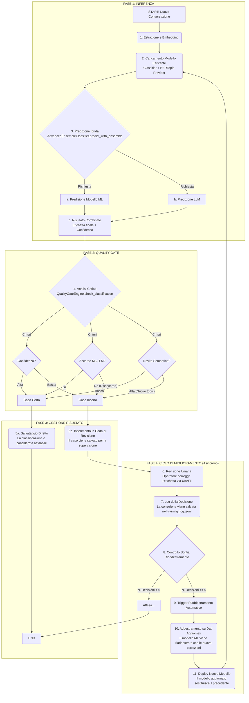

# Documentazione Tecnica Approfondita: Pipeline di Classificazione Supervisionata

**Versione Documento**: PRO 2.5  
**Autore Analisi**: GitHub Copilot  
**Data Analisi**: 2025-08-20

Questo documento fornisce un'analisi tecnica dettagliata e passo-passo dei flussi di lavoro del sistema di classificazione, basata sull'ispezione diretta del codice sorgente.

---

## 1. Architettura dei Componenti Fondamentali

Il sistema è un ecosistema di moduli Python che interagiscono per realizzare un ciclo di vita completo di machine learning: dalla scoperta di conoscenza all'addestramento supervisionato, fino all'inferenza in produzione e al miglioramento continuo.

| Componente Chiave | Classe Python | File Sorgente | Responsabilità Primaria |
| :--- | :--- | :--- | :--- |
| **Orchestratore Pipeline** | `EndToEndPipeline` | `Pipeline/end_to_end_pipeline.py` | Gestisce e sequenzia le operazioni complesse di training e classificazione batch. |
| **Motore di Qualità** | `QualityGateEngine` | `QualityGate/quality_gate_engine.py` | Cuore della supervisione. Filtra le predizioni, gestisce la coda di revisione e il riaddestramento. |
| **Classificatore Ibrido** | `AdvancedEnsembleClassifier` | `Classification/advanced_ensemble_classifier.py` | Esegue le predizioni combinando un ensemble di modelli ML e un LLM. |
| **Motore di Clustering** | `HDBSCANClusterer` | `Clustering/hdbscan_clusterer.py` | Raggruppa le conversazioni per similarità semantica (topic discovery). |
| **Supervisore Interattivo** | `InteractiveTrainer` | `HumanReview/interactive_trainer.py` | Gestisce il dialogo con l'operatore umano durante la fase di etichettatura. |
| **Motore di Embedding** | `LaBSEEmbedder` | `EmbeddingEngine/labse_embedder.py` | Vettorizza il testo delle conversazioni in uno spazio semantico. |
| **Gestore Tag Dinamici** | `TagDatabaseConnector` | `TagDatabase/tag_database_connector.py` | Interagisce con il DB MySQL per la gestione dei tag e il salvataggio dei risultati. |
| **Estrattore Dati** | `LettoreConversazioni` | `LettoreConversazioni/session_reader.py` | Legge e pre-processa i dati grezzi dai database dei clienti. |

---

## 2. Flusso 1: Pipeline di Training Supervisionato Iniziale

Questo flusso descrive il processo completo per addestrare da zero un sistema di classificazione per un nuovo cliente. È un processo *human-in-the-loop* orchestrato da `EndToEndPipeline.esegui_pipeline_completa`.

**Obiettivo**: Partire da dati grezzi non etichettati e produrre un modello di classificazione ML/LLM robusto e validato da un umano.

### Diagramma di Flusso Dettagliato: Training Iniziale

```mermaid
graph TD
    subgraph "FASE A: Preparazione e Scoperta (Discovery)"
        A[START: esegui_pipeline_completa] --> B(1. Estrazione Dati<br>LettoreConversazioni.get_conversations_for_analysis);
        B --> C(2. Aggregazione Sessioni<br>SessionAggregator.aggregate);
        C --> D(3. Generazione Embeddings<br>LaBSEEmbedder.encode);
        D --> E(4. Clustering Semantico<br>HDBSCANClusterer.fit_predict);
        E --> F(5. Estrazione Rappresentanti<br>Selezione dei 3 esempi più significativi per cluster);
        F --> G(6. Suggerimento Etichette Iniziali<br>BERTopic o LLM analizzano i cluster per proporre un'etichetta);
    end

    subgraph "FASE B: Supervisione Umana (Human-in-the-Loop)"
        G --> H{7. Ciclo di Revisione Interattiva<br>InteractiveTrainer.review_cluster_representatives};
        H -- Per ogni cluster --> I[a. Mostra rappresentanti e etichetta suggerita];
        I --> J{b. Decisione Umano};
        J -- Accetta --> K[Conferma etichetta];
        J -- Modifica --> L[Inserisce nuova etichetta];
        J -- Usa LLM --> M[Usa suggerimento alternativo LLM];
        K & L & M --> N[c. Richiedi confidenza (1-5)];
        N --> H;
        H -- Fine revisione --> O[Dataset di Training Validato<br>Embeddings + Etichette Finali];
    end

    subgraph "FASE C: Addestramento e Salvataggio"
        O --> P(8. Feature Augmentation (Opzionale)<br>BERTopicProvider.fit_transform);
        P --> Q(9. Addestramento Ensemble ML<br>AdvancedEnsembleClassifier.train_ml_ensemble);
        Q --> R(10. Validazione Incrociata<br>Calcolo metriche di performance del modello ML);
        R --> S(11. Salvataggio Artefatti<br>Modello .pkl, provider BERTopic, statistiche);
    end
    
    subgraph "FASE D: Classificazione Finale"
        S --> T(12. Classificazione Batch<br>Il nuovo modello classifica tutte le sessioni iniziali);
        T --> U(13. Salvataggio nel Database<br>TagDatabaseConnector.save_classification);
        U --> V[END];
    end
```

### Analisi Passo-Passo del Flusso di Training

1.  **Estrazione Dati**: La pipeline invoca `LettoreConversazioni` per leggere le conversazioni recenti dal DB del cliente.
2.  **Aggregazione Sessioni**: I messaggi vengono raggruppati in sessioni di dialogo complete. Le sessioni con un solo messaggio vengono scartate.
3.  **Generazione Embeddings**: `LaBSEEmbedder` viene utilizzato per convertire il testo pulito di ogni sessione in un vettore semantico a 768 dimensioni.
4.  **Clustering Semantico**: `HDBSCANClusterer` riceve la matrice di embeddings e identifica gruppi di conversazioni semanticamente simili (i cluster). Questo passaggio è fondamentale per la *topic discovery*.
5.  **Estrazione Rappresentanti**: Per ogni cluster identificato, la pipeline seleziona intelligentemente fino a 3 conversazioni che meglio lo rappresentano. La selezione non è casuale ma mira a massimizzare la diversità interna al cluster per dare all'operatore una visione completa.
6.  **Suggerimento Etichette Iniziali**: Un modello (BERTopic o un LLM) analizza il contenuto dei cluster e propone un'etichetta testuale (es. "richiesta_informazioni_esame").
7.  **Ciclo di Revisione Interattiva**:
    *   Questo è il cuore della supervisione umana, gestito da `InteractiveTrainer`.
    *   Per ogni cluster, il sistema mostra all'operatore le conversazioni rappresentative e l'etichetta suggerita.
    *   L'operatore ha la facoltà di accettare, modificare o sostituire l'etichetta, potendo anche chiedere un parere alternativo all'LLM.
    *   Infine, l'operatore assegna un livello di confidenza alla sua scelta.
    *   Il risultato di questa fase è un set di dati (embeddings ed etichette) di altissima qualità, poiché validato da un umano.
8.  **Feature Augmentation**: Se la configurazione lo prevede, `BERTopicProvider` viene addestrato sui dati e genera feature aggiuntive (come le probabilità di appartenenza ai topic) che vengono unite agli embeddings per fornire più segnale al modello ML.
9.  **Addestramento Ensemble ML**: `AdvancedEnsembleClassifier` utilizza i dati validati per addestrare i suoi modelli interni (es. RandomForest, XGBoost).
10. **Validazione Incrociata**: Durante il training, il classificatore esegue una validazione incrociata per stimare le proprie performance (accuracy, F1-score) e prevenire l'overfitting.
11. **Salvataggio Artefatti**: Il modello ML addestrato, il `BERTopicProvider` e un file di statistiche vengono serializzati e salvati su disco, pronti per essere usati in produzione.
12. **Classificazione Batch**: A conclusione del training, la pipeline utilizza il modello appena creato per classificare l'intero set di dati estratto all'inizio.
13. **Salvataggio nel Database**: I risultati finali vengono scritti nella tabella delle classificazioni del database MySQL tramite il `TagDatabaseConnector`.

---

## 3. Flusso 2: Classificazione Operativa e Miglioramento Continuo

Questo flusso descrive l'operatività quotidiana del sistema quando classifica nuove conversazioni usando un modello esistente. È orchestrato principalmente dal `QualityGateEngine`.

**Obiettivo**: Classificare nuove conversazioni in modo rapido e accurato, isolando i casi incerti per la revisione umana e migliorando il sistema nel tempo.

### Diagramma di Flusso Dettagliato: Operatività e Quality Gate



### Analisi Passo-Passo del Flusso Operativo

1.  **Estrazione e Embedding**: Una nuova conversazione viene processata e trasformata in un vettore embedding.
2.  **Caricamento Modello**: Il sistema carica in memoria il classificatore ML e il `BERTopicProvider` specifici per il cliente.
3.  **Predizione Ibrida**: `AdvancedEnsembleClassifier` gestisce l'inferenza:
    *   Il modello ML calcola la sua predizione basandosi sull'embedding (e sulle feature di topic, se presenti).
    *   Parallelamente, l'LLM fornisce la sua predizione basandosi sul testo grezzo.
    *   Una logica di pesatura combina i due output per generare un'etichetta finale e un punteggio di confidenza complessivo.
4.  **Analisi Critica (Quality Gate)**: Questa è la fase cruciale. `QualityGateEngine` valuta la classificazione appena prodotta:
    *   **Confidenza**: Il punteggio di confidenza è sufficientemente alto? (es. > 0.9)
    *   **Accordo**: La predizione del modello ML e quella dell'LLM coincidono?
    *   **Novità Semantica**: L'embedding della conversazione è molto distante (nello spazio vettoriale) da quelli visti durante il training? Questo indica un potenziale nuovo argomento non gestito dal modello attuale.
5.  **Gestione del Risultato**:
    *   **Caso Certo**: Se tutti i controlli di qualità vengono superati, la classificazione è ritenuta affidabile e viene salvata direttamente nel database.
    *   **Caso Incerto**: Se anche solo uno dei controlli fallisce, la classificazione viene marcata per la revisione umana e messa in una coda dedicata.
6.  **Revisione Umana**: Un operatore, tramite un'interfaccia dedicata (web o altro), analizza i casi incerti e fornisce la classificazione corretta.
7.  **Log della Decisione**: Ogni correzione manuale viene registrata in modo persistente in un file di log (`training_decisions.jsonl`). Questo file è la "verità" e costituisce la base per il miglioramento futuro.
8.  **Controllo Soglia Riaddestramento**: Ad ogni nuova decisione registrata, il sistema controlla se è stato raggiunto il numero minimo di correzioni per giustificare un riaddestramento (es. 5).
9.  **Trigger Riaddestramento Automatico**: Una volta raggiunta la soglia, il `QualityGateEngine` avvia un processo di riaddestramento in background.
10. **Addestramento su Dati Aggiornati**: Il classificatore ML viene riaddestrato utilizzando tutti i dati di training originali più le nuove correzioni umane.
11. **Deploy Nuovo Modello**: Il modello appena addestrato, ora più accurato, sostituisce quello vecchio e verrà utilizzato per le classificazioni successive, completando così il ciclo di miglioramento continuo.
