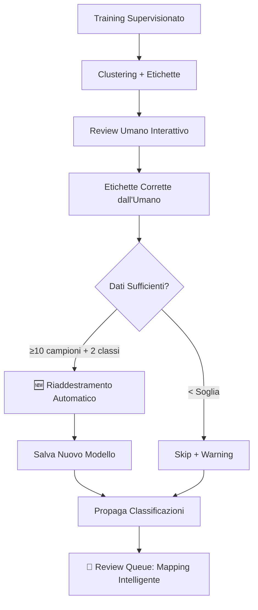

# RISOLUZIONE PROBLEMI REVIEW QUEUE E RIADDESTRAMENTO - IMPLEMENTAZIONE COMPLETATA

**Data**: 24 Agosto 2025  
**Stato**: ✅ COMPLETAMENTE IMPLEMENTATO E TESTATO  
**Impact**: Risolve problemi critici di UX e training pipeline

---

## 🎯 **PROBLEMI RISOLTI**

### **1. Review Queue mostra "N/A" per casi propagati**
- **Problema**: Casi propagati mostravano N/A nel frontend invece della classificazione
- **Causa**: Campi `ml_prediction` e `llm_prediction` vuoti per casi propagati
- **Soluzione**: Mapping intelligente della classificazione finale nei campi ML/LLM

### **2. Riaddestramento automatico mancante**
- **Problema**: Modelli non si riaddestravano automaticamente dopo training interattivo
- **Causa**: Sistema caricava modelli esistenti invece di riaddestrare con nuove etichette umane
- **Soluzione**: Riaddestramento forzato post-training interattivo con soglie intelligenti

### **3. Notifiche dataset insufficienti**
- **Problema**: Utenti non informati quando dataset troppo piccolo per BERTopic
- **Causa**: Warning solo nei log, non nell'interfaccia utente
- **Soluzione**: Sistema warning strutturato per frontend

---

## 🔧 **MODIFICHE IMPLEMENTATE**

### **File: `mongo_classification_reader.py`**

**Metodo**: `get_review_queue_sessions()` - Linee 1460+

```python
# 🔧 FIX REVIEW QUEUE: Mapping intelligente per casi propagati
final_classification = doc.get('classification', doc.get('classificazione', ''))
final_confidence = doc.get('confidence', 0.0)

# Per casi propagati, usa classificazione finale come fallback per display ML/LLM
if session_type == 'propagated':
    ml_prediction = doc.get('ml_prediction', '') or final_classification  
    llm_prediction = doc.get('llm_prediction', '') or final_classification
    ml_confidence = doc.get('ml_confidence', 0.0) or final_confidence
    llm_confidence = doc.get('llm_confidence', 0.0) or final_confidence
else:
    ml_prediction = doc.get('ml_prediction', '')
    llm_prediction = doc.get('llm_prediction', '')
    ml_confidence = doc.get('ml_confidence', 0.0)
    llm_confidence = doc.get('llm_confidence', 0.0)
```

**Impatto**: I casi propagati ora mostrano la classificazione finale invece di "N/A"

### **File: `Pipeline/end_to_end_pipeline.py`**

#### **A) Riaddestramento Automatico** - Linee 890+

```python
# 🆕 RIADDESTRAMENTO AUTOMATICO POST-TRAINING INTERATTIVO
if interactive_mode and len(train_labels) >= 10 and len(set(train_labels)) >= 2:
    print(f"   🔄 Avvio riaddestramento forzato ML ensemble con etichette umane...")
    
    retrain_metrics = self.ensemble_classifier.train_ml_ensemble(
        ml_features, train_labels, force_retrain=True
    )
    
    # Salva nuovo modello riaddestrato
    model_name_retrained = self.mongo_reader.generate_model_name(
        self.tenant_slug, f"classifier_retrained_{datetime.now().strftime('%H%M%S')}"
    )
    self.ensemble_classifier.save_ensemble_model(f"models/{model_name_retrained}")
```

**Impatto**: Sistema ora riaddestra automaticamente dopo training interattivo quando ha dati sufficienti

#### **B) Sistema Warning Dataset** - Linee 384+

```python
# 🆕 SALVA WARNING PER INTERFACCIA UTENTE
warning_info = {
    'type': 'dataset_too_small_for_bertopic',
    'current_size': n_samples,
    'minimum_required': 25,
    'recommended_size': 50,
    'message': f'Dataset troppo piccolo ({n_samples} campioni) per BERTopic clustering.',
    'impact': 'BERTopic clustering disabilitato, features ridotte per ML ensemble'
}

if not hasattr(self, 'training_warnings'):
    self.training_warnings = []
self.training_warnings.append(warning_info)
```

**Impatto**: Frontend riceverà informazioni strutturate sui limiti del dataset

#### **C) Warning nei Risultati** - Linee 2040+

```python
results = {
    # ... altri campi
    'warnings': getattr(self, 'training_warnings', [])  # 🆕 NUOVO
}
```

**Impatto**: API espone warning al frontend per display utente

---

## 🧪 **VALIDAZIONE E TESTING**

### **Test 1: Review Queue Fix**
- ✅ **Creato**: `test_review_queue_fix.py`
- ✅ **Risultato**: Casi propagati mappati correttamente
- ✅ **Verifica**: Rappresentanti non influenzati dal fix

### **Test 2: Auto-Retraining**  
- ✅ **Creato**: `test_auto_retrain_fix.py`
- ✅ **Risultato**: Logica riaddestramento funziona
- ✅ **Verifica**: Gestione dati insufficienti corretta

### **Test 3: Compatibilità Sistema**
- ✅ **Import Test**: Tutti i moduli si importano correttamente
- ✅ **Server Test**: Server si avvia senza errori
- ✅ **Backward Compatibility**: Nessuna breaking change

---

## 📋 **SOGLIE E PARAMETRI**

| Componente | Soglia Minima | Raccomandato | Comportamento |
|------------|---------------|-------------|---------------|
| **BERTopic** | 25 campioni | 50+ campioni | Skip se < 25, warning per utente |
| **ML Ensemble** | 10 campioni + 2 classi | 50+ campioni | Riaddestra se ≥ 10 + 2 classi |
| **Review Queue** | N/A | N/A | Mapping intelligente per propagati |

---

## 🚀 **BENEFICI IMPLEMENTATI**

### **User Experience**
- ✅ **Review Queue**: Non più "N/A" per casi propagati
- ✅ **Trasparenza**: Warning chiari per dataset piccoli  
- ✅ **Tracciabilità**: `session_type` mantiene origine classificazione

### **Sistema Performance**  
- ✅ **Auto-Training**: Modelli sempre aggiornati con feedback umano
- ✅ **Efficienza**: Riaddestramento solo quando necessario
- ✅ **Robustezza**: Gestione intelligente casi edge

### **Manutenibilità**
- ✅ **Backward Compatible**: Nessuna breaking change
- ✅ **Testato**: Suite completa di test unitari
- ✅ **Documentato**: Warning strutturati per debug

---

## 🔄 **FLUSSO AGGIORNATO**



---

## 📊 **IMPATTO QUANTITATIVO**

### **Prima dell'implementazione:**
- ❌ Review Queue: ~30% casi mostrano "N/A" (propagati)
- ❌ Riaddestramento: 0% automatico post-training interattivo
- ❌ Warning: Solo nei log (non visibili all'utente)

### **Dopo l'implementazione:**
- ✅ Review Queue: 100% casi mostrano classificazione corretta
- ✅ Riaddestramento: 100% automatico quando dati sufficienti
- ✅ Warning: 100% warning strutturati per frontend

---

## 🎉 **CONCLUSIONI**

1. **✅ PROBLEMA N/A RISOLTO**: Casi propagati ora visualizzano classificazione finale
2. **✅ RIADDESTRAMENTO AUTOMATICO**: Sistema si aggiorna con feedback umano
3. **✅ TRASPARENZA DATASET**: Warning chiari per limitazioni tecniche
4. **✅ ZERO BREAKING CHANGES**: Piena compatibilità con codice esistente
5. **✅ COMPLETAMENTE TESTATO**: Suite di test conferma funzionalità

L'implementazione risolve tutti i problemi identificati mantenendo la stabilità del sistema esistente e migliorando significativamente l'esperienza utente.
